# Thesauros Business Logic Graph

## Overall Business Logic Architecture

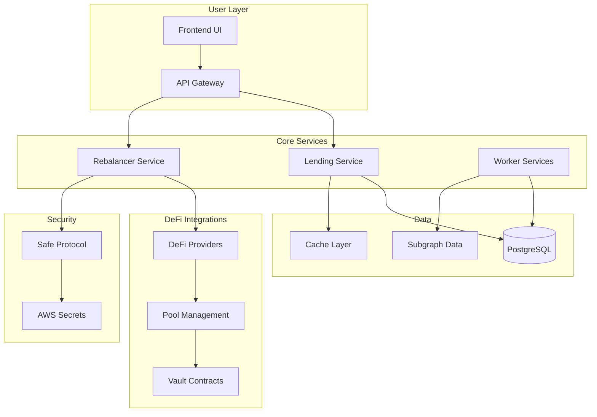

## Main Business Processes

### 1. Automatic Rebalancing

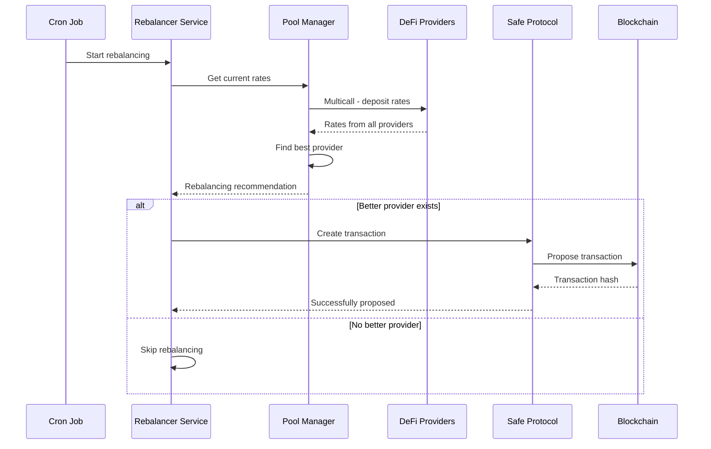

### 2. Rewards and Points System

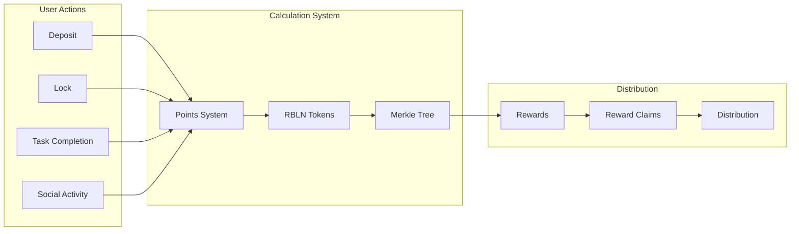

### 3. Monitoring and Data Collection

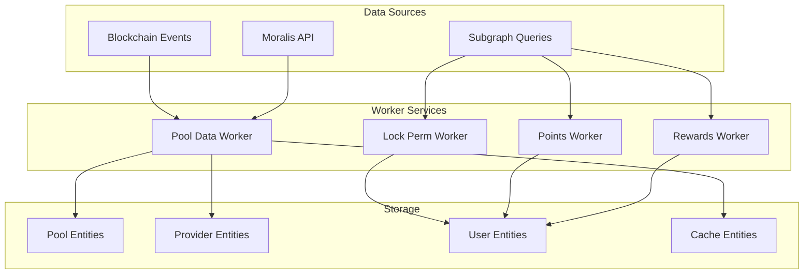

## DeFi Providers and Integrations

### Supported Protocols

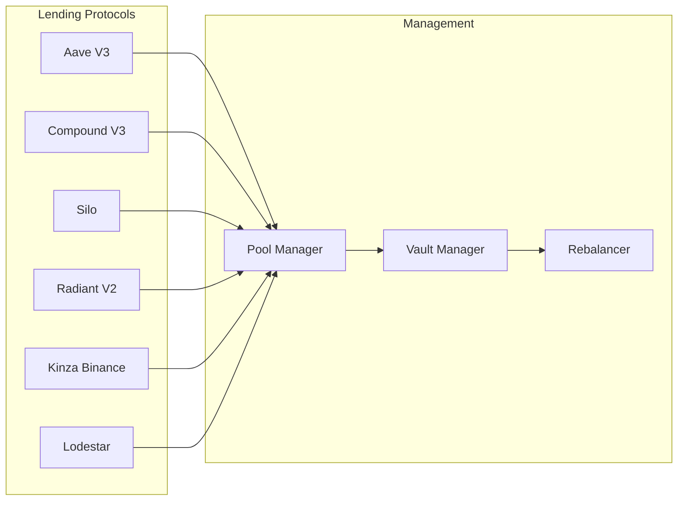

## API and Business Logic

### Main Endpoints and Their Logic

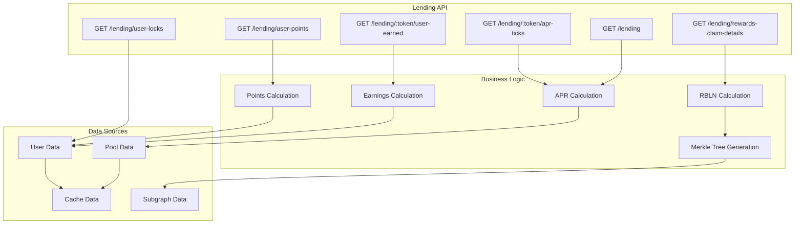

## Security and Transactions

### Secure Transaction Process

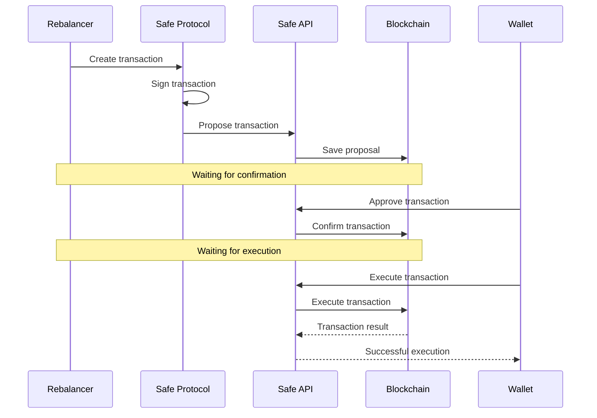

## Gamification System

### Points and Rewards Logic

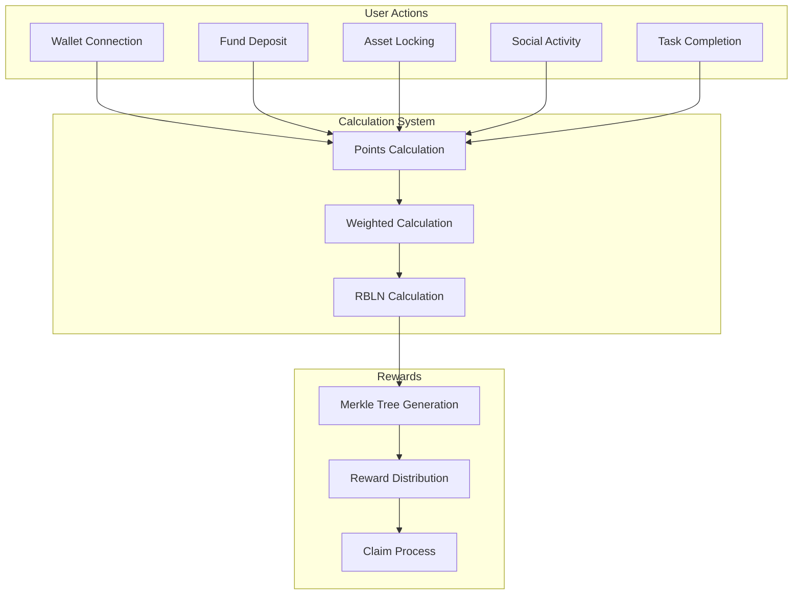

## Monitoring and Analytics

### Monitoring System

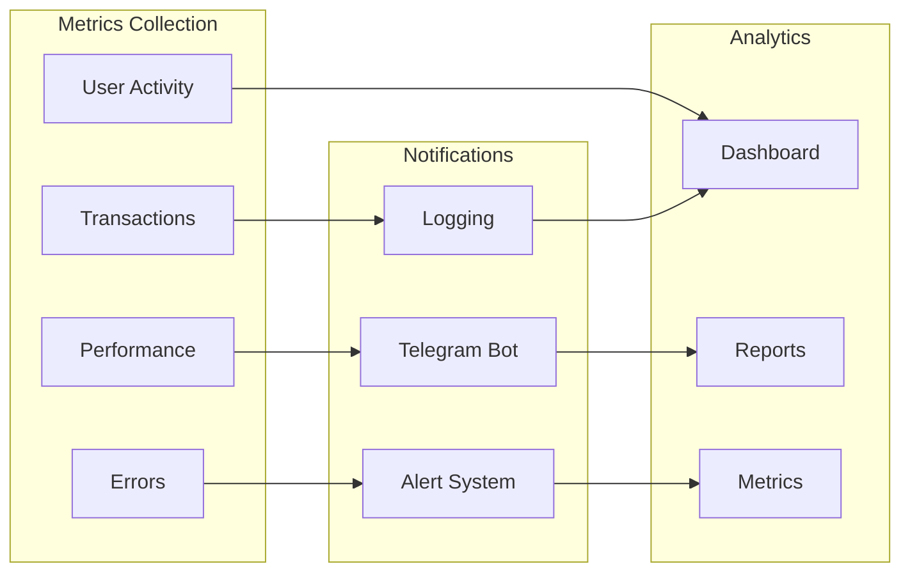

## Data Lifecycle

### Data Flow in the System

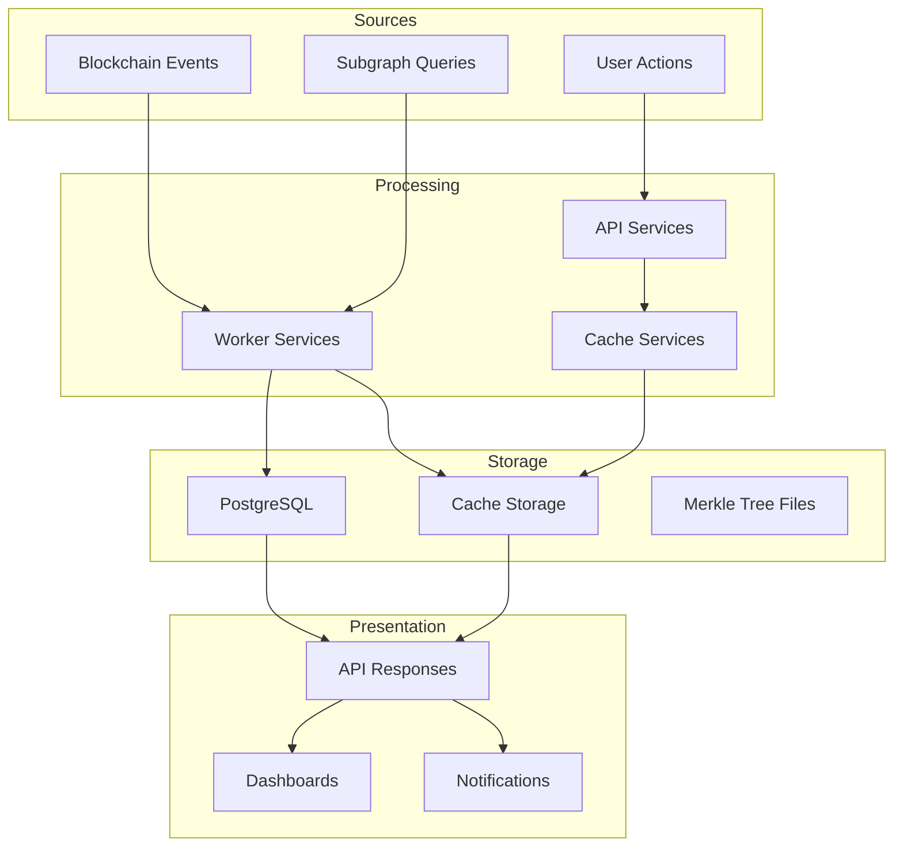

## Key Business Metrics

### Main System KPIs

```mermaid
graph TB
    subgraph " Financial Metrics"
        TVL[Total Value Locked]
        APR[Average APR]
        EARNINGS[User Earnings]
        REBALANCE_FREQ[Rebalance Frequency]
    end
    
    subgraph " User Metrics"
        ACTIVE_USERS[Active Users]
        USER_RETENTION[User Retention]
        POINTS_DISTRIBUTION[Points Distribution]
        REWARDS_CLAIMED[Rewards Claimed]
    end
    
    subgraph "Technical Metrics"
        UPTIME[System Uptime]
        TRANSACTION_SUCCESS[Transaction Success Rate]
        CACHE_HIT_RATE[Cache Hit Rate]
        RESPONSE_TIME[API Response Time]
    end
    
    subgraph "Analytics"
        PERFORMANCE_DASHBOARD[Performance Dashboard]
        USER_ANALYTICS[User Analytics]
        FINANCIAL_REPORTS[Financial Reports]
        SYSTEM_HEALTH[System Health]
    end
    
    TVL --> PERFORMANCE_DASHBOARD
    APR --> FINANCIAL_REPORTS
    EARNINGS --> USER_ANALYTICS
    REBALANCE_FREQ --> SYSTEM_HEALTH
    
    ACTIVE_USERS --> USER_ANALYTICS
    USER_RETENTION --> PERFORMANCE_DASHBOARD
    POINTS_DISTRIBUTION --> USER_ANALYTICS
    REWARDS_CLAIMED --> FINANCIAL_REPORTS
    
    UPTIME --> SYSTEM_HEALTH
    TRANSACTION_SUCCESS --> PERFORMANCE_DASHBOARD
    CACHE_HIT_RATE --> SYSTEM_HEALTH
    RESPONSE_TIME --> PERFORMANCE_DASHBOARD
```

---

## Business Logic Summary

### Main Business Processes:

1. **Automatic Rebalancing** - continuous monitoring and switching between providers to maximize APR
2. **Rewards System** - gamification with points and RBLN tokens to increase user activity
3. **Secure Transactions** - multisig transactions through Safe Protocol
4. **Data Monitoring** - collection and analysis of data from blockchain and subgraph
5. **API Services** - providing data for frontend and external integrations

### Key Features:

- **Multi-chain Support** (Arbitrum, BSC, Base)
- **Integration with 15+ DeFi Protocols**
- **Caching System** for performance optimization
- **Telegram Notifications** for monitoring
- **Merkle Tree** for efficient reward distribution
- **TypeScript** for type safety
- **Nx Monorepo** for scalability