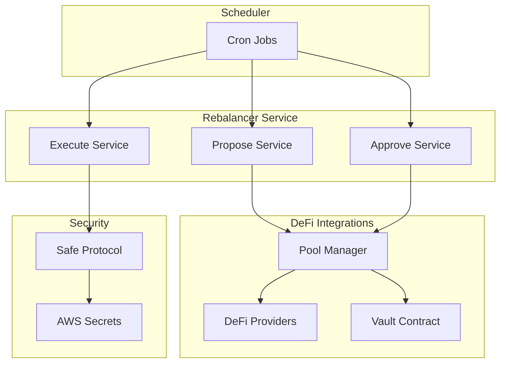
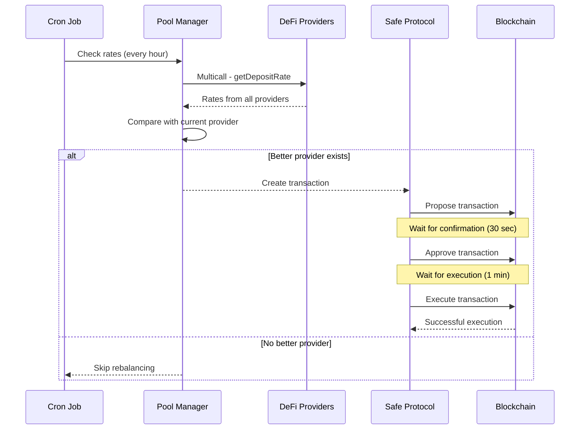

# Rebalancer Service Analysis

## Service Overview

The **Rebalancer** service is a key component of the Thesauros system, responsible for automatically switching assets between various DeFi lending protocols to maximize user returns.

## Service Architecture

### Component Structure



## Rebalancing Logic

### Main Algorithm (Simple Strategy)

```typescript
// Key logic in Pool.rebalanceSimple()
private async rebalanceSimple(blockNumber: number) {
  // 1. Get deposit rates from all providers
  const depositRates = await this.depositRates(blockNumber);
  
  // 2. Map providers to rates
  const providersWithDepositRates = this.providers.map((provider, index) => ({
    provider,
    depositRate: depositRates[index],
  }));
  
  // 3. Find provider with maximum rate
  const newActiveProviderWithDepositRate = providersWithDepositRates.reduce(
    (max, current) => (current.depositRate > max.depositRate ? current : max),
    providersWithDepositRates[0]
  );
  
  // 4. Get current active provider
  const activeProvider = await this.vault.activeProvider({ blockTag: blockNumber });
  
  // 5. Compare rates
  const activeProviderWithDepositRate = providersWithDepositRates.find(
    (providerWithDepositRate) => providerWithDepositRate.provider.contract.target == activeProvider
  );
  
  // 6. Rebalancing decision
  if (activeProviderWithDepositRate.depositRate == newActiveProviderWithDepositRate.depositRate) 
    return null; // No rebalancing needed
  
  // 7. Return rebalancing parameters
  return [
    this.vault.target,           // Vault address
    MaxUint256,                  // Maximum token amount
    activeProviderWithDepositRate.provider.contract.target,    // Current provider
    newActiveProviderWithDepositRate.provider.contract.target, // New provider
    0n,                          // Minimum token amount
    true,                        // Rebalancing flag
  ];
}
```

## Pool Selection Criteria

### 1. **Main Criterion: Deposit Rate (APR)**

```typescript
// Get deposit rates via multicall
private async depositRates(blockNumber: number) {
  const aggregateData = this.providers.map((provider) => ({
    target: provider.contract.target,
    callData: Interfaces.IProviderMulticallInterface.getDepositRate.callData(this.vault.target),
    callBack: Interfaces.IProviderMulticallInterface.getDepositRate.callBack,
  }));
  
  const aggregateResult = await multicalls[this.network].aggregate.staticCall(aggregateData, {
    blockTag: blockNumber,
  });
  
  return aggregateResult.returnData.map((data, index) => aggregateData[index].callBack(data));
}
```

### 2. **Pool Weighted Rate Calculation**

```typescript
public async depositRate(blockNumber: number) {
  const [balances, depositRates] = await Promise.all([
    this.balances(blockNumber), 
    this.depositRates(blockNumber)
  ]);
  
  const totalBalances = balances.reduce((total, balance) => (total += balance), 0n);
  const weightedBalances = balances.map((balance, index) => balance * depositRates[index]);
  const totalWeightedBalance = weightedBalances.reduce((total, weightedBalance) => (total += weightedBalance), 0n);
  
  if (totalBalances > 0) 
    return totalWeightedBalance / totalBalances; // Weighted rate
  
  // If no balances, return active provider rate
  const activeProviderAddress = await this.vault.activeProvider({ blockTag: blockNumber });
  const activeProvider = this.providers.find((provider) => provider.contract.target == activeProviderAddress);
  return await activeProvider.contract.getDepositRate.staticCall(this.vault.target, { blockTag: blockNumber });
}
```

### 3. **Rebalancing Conditions**

- **Strict comparison**: `activeProviderRate == newProviderRate` → no rebalancing
- **Any improvement**: `newProviderRate > activeProviderRate` → rebalancing
- **No minimum threshold**: system responds to any rate improvement

## Time Intervals

### Cron Schedule

```typescript
export enum CronExpressions {
  Propose = CronExpression.EVERY_HOUR,    // Every hour
  Approve = CronExpression.EVERY_30_SECONDS, // Every 30 seconds
  Execute = CronExpression.EVERY_MINUTE,  // Every minute
}
```

### Time Interval Logic

1. **Propose (every hour)**: Check for rebalancing need
2. **Approve (every 30 sec)**: Quick transaction confirmation
3. **Execute (every minute)**: Execute confirmed transactions

## Secure Transaction Process

### 1. **Propose Service**

```typescript
@Cron(CronExpressions.Propose)
public async propose() {
  const blockNumber = await jsonRpcProviders[this.network].getBlockNumber();
  const args = await pools[this.network][this.token].rebalance(this.strategy, blockNumber);
  
  if (!args) {
    Logger.log('Nothing to propose');
    return;
  }
  
  // Create Safe transaction
  const data = VaultManager__factory.createInterface().encodeFunctionData('rebalanceVault', args);
  const safeTransactionData: SafeTransactionDataPartial = {
    to: pools[this.network][this.token].vaultManagerAddress,
    data,
    value: '0',
  };
  
  // Sign and propose transaction
  const safeTransaction = await this.safe.createTransaction({ transactions: [safeTransactionData] });
  const safeTxHash = await this.safe.getTransactionHash(safeTransaction);
  const senderSignature = await this.safe.signHash(safeTxHash);
  
  await this.safeApiKit.proposeTransaction({
    safeAddress: pools[this.network][this.token].safeAddress,
    safeTransactionData: safeTransaction.data,
    safeTxHash,
    senderAddress: this.wallet.address,
    senderSignature: senderSignature.data,
    origin: blockNumber.toString(),
  });
}
```

### 2. **Approve Service**

```typescript
@Cron(CronExpressions.Approve)
public async approve() {
  const safeTxs = await this.safeApiKit.getPendingTransactions(pools[this.network][this.token].safeAddress);
  
  if (safeTxs.count == 0) return;
  
  const safeTx = safeTxs.results[0];
  
  // Check if already confirmed
  if (safeTx.confirmations.find((confirmation) => confirmation.owner == this.wallet.address)) {
    return;
  }
  
  // Validate transaction
  const blockNumber = parseInt(safeTx.origin);
  const data = VaultManager__factory.createInterface().encodeFunctionData(
    'rebalanceVault',
    await pools[this.network][this.token].rebalance(this.strategy, blockNumber)
  );
  
  if (data != safeTx.data) 
    throw new Error(`Rejected. Safe transaction hash: ${safeTx.safeTxHash}`);
  
  // Confirm transaction
  await this.safeApiKit.confirmTransaction(
    safeTx.safeTxHash,
    await this.safe.signHash(safeTx.safeTxHash).then((res) => res.data)
  );
}
```

### 3. **Execute Service**

```typescript
@Cron(CronExpressions.Execute)
private async execute() {
  const safeTxs = await this.safeApiKit.getPendingTransactions(pools[this.network][this.token].safeAddress);
  
  if (safeTxs.count == 0) return;
  
  const safeTx = safeTxs.results[0];
  
  // Check sufficient confirmations
  if (safeTx.confirmationsRequired > safeTx.confirmations.length)
    throw new Error(`Not enough confirmations. Safe transaction hash: ${safeTx.safeTxHash}`);
  
  // Execute transaction
  const executedTx = await this.safe.executeTransaction(safeTx);
  const txReceipt = await executedTx.transactionResponse?.wait();
  
  if (!(txReceipt?.status == 1)) 
    throw new Error(`Failed. Transaction hash: ${executedTx.hash}`);
}
```

## Supported Providers

### Pool Configuration

```typescript
// Example configuration for USDT on Arbitrum
[Enums.TokenEnum.USDT]: new Pool(
  Rebalancer__factory.connect('0x2469c01daf31b68603Bd57E2FFf75E548223EA17', jsonRpcProviders[Enums.NetworkEnum.Arbitrum]),
  [
    new CompoundV3Provider('0x2CeB49E36c23364082e8b476777D94Dba79E6571', Enums.NetworkEnum.Arbitrum),
    new AaveV3Provider('0xD275d04BCd03898d54d3aA8229F1e9ceE0f6afc1', Enums.NetworkEnum.Arbitrum),
    new DolomiteProvider('0x2277758D77b3FD7F834fa95ecDCc0739094CCf46', Enums.NetworkEnum.Arbitrum),
  ],
  Enums.NetworkEnum.Arbitrum,
  '0x0cA0872857D12f9921a7aF71716055E52FE476c3', // Safe address
  '0xBC02429cC88e26d628830C45838fE2dA8da339c3'  // Vault manager address
)
```

### Provider List by Token

| Token | Providers |
|-------|-----------|
| USDT | Compound V3, Aave V3, Dolomite |
| wETH | Compound V3, Aave V3, Dolomite |
| USDC | Compound V3, Aave V3, Dolomite |
| USDC.e | Compound V3, Aave V3, Dolomite |
| DAI | Aave V3, Dolomite |
| FRAX | Aave V3, Fraxlend, Venus, Spark Morpho, Moonwell Morpho, Seamless Morpho, Steakhouse Morpho, Gauntlet Core Morpho, Gauntlet Prime Morpho, Apostro Resolv Morpho |

## Service Business Tasks

### 1. **Return Maximization**
- Automatic search for best APR rates among all providers
- Instant switching when conditions improve
- Pool weighted return optimization

### 2. **Management Automation**
- Eliminate manual rate monitoring
- Automatic rebalancing decisions
- Reduce operational costs

### 3. **Transaction Security**
- Multisig confirmations through Safe Protocol
- Transaction validation before execution
- Protection against unauthorized operations

### 4. **Monitoring and Transparency**
- Logging of all rebalancing operations
- Tracking rate changes
- Telegram notifications

### 5. **Scalability**
- Support for multiple tokens and networks
- Modular architecture for adding new providers
- Efficient multicall usage for optimization

## Performance Metrics

### Key Indicators

1. **Rebalancing Frequency** - how many times switching occurred
2. **APR Improvement** - average rate increase after rebalancing
3. **Execution Time** - speed from proposal to execution
4. **Transaction Success Rate** - percentage of successful rebalancing
5. **Gas Costs** - cost of rebalancing operations

### Limitations and Risks

1. **Gas Costs** - frequent rebalancing can be expensive
2. **Rate Volatility** - rapid changes can lead to frequent switching
3. **Blockchain Delays** - transaction confirmation time
4. **Smart Contract Risks** - dependency on provider security

## Rebalancing Lifecycle


---